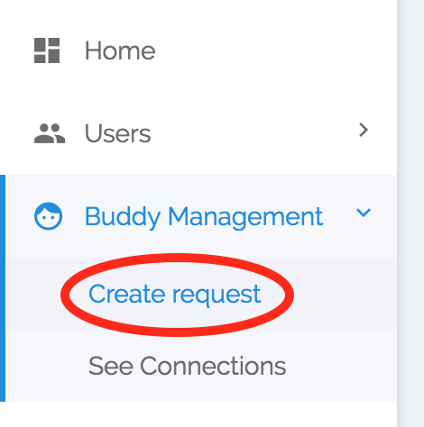
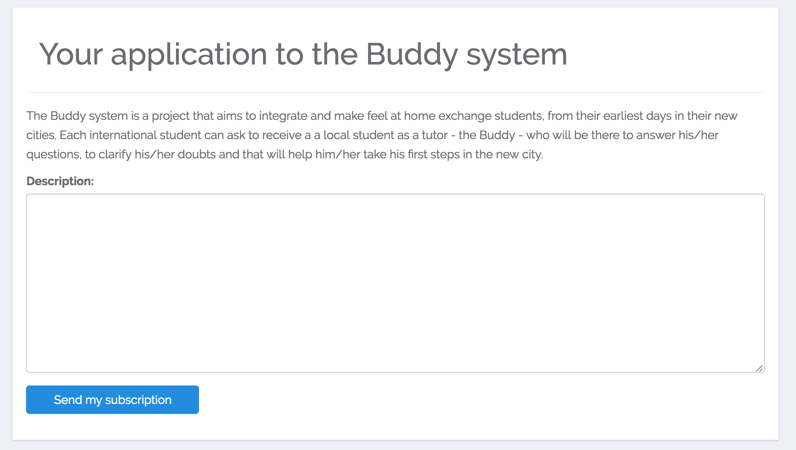
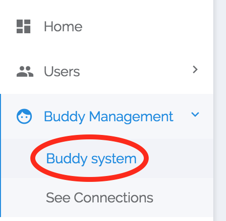
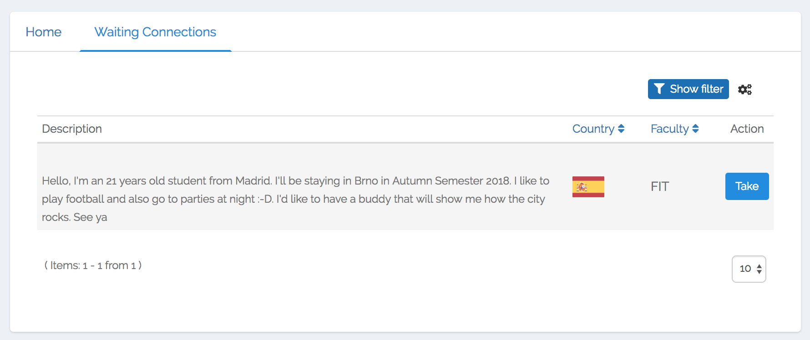
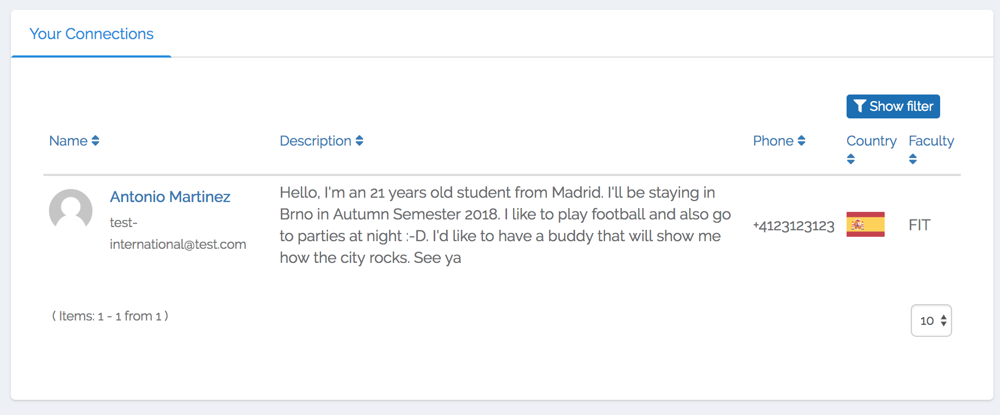
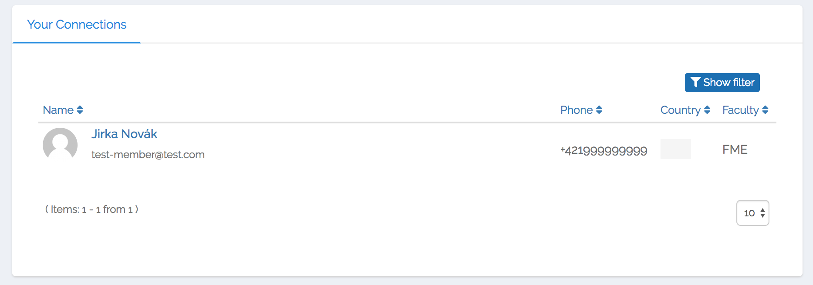

# Buddy Management
In this section, you will find information about how the buddy management system works and how to use it.

Our buddy system idea is to connect international exchange students with local students. The local students can show exchange students the city, help them with settling in and usually spends time with them during the whole semester as it results in a nice friendship. The Fiesta system is here to help to make the first connection.

First the **international exchange student** has to make [buddy request](#buddy-request). Afterwards when the buddy selection period starts (usually few weeks or a month before the start of the semester) the local student is able to find the buddy that fits best his/her interests. Since the **name**, **country** and your **request description** are the only things there to consider when looking for your soul mate, we encourage exchange students to write more about themselves in the request description.

## Buddy Request

If you are an **international exchange student** you can create your buddy request in Buddy Management section accessible through the menu on the left.

Fill in a description about yourself. It's good to describe who you are, what are your interests, what are you going to study, etc. This is a good place for stating if you have any specific requests on your buddy but please keep in mind that all buddies are volunteers and the more requirements you have the worse chance to get a buddy.

## Becoming a buddy

If you are a **local student** you will be able to look through the buddy requests and pick the international student that fits you best. You can find a list of pending requests in the Buddy System section accessible through the menu on the left.

Then in the **Waiting Connections** tab, you can find the buddy requests waiting for you.

By clicking on the button **Take** you will be assigned as a buddy to the selected international exchange student.

## Contact your Buddy / International Student

After you "take the international student under your wings" you will be able to see him/her in the connections section accessible through the menu on the left by clicking on the **See connections** link. You will be able to see the contact information and you can start meeting up.

The same applies to an international student.

