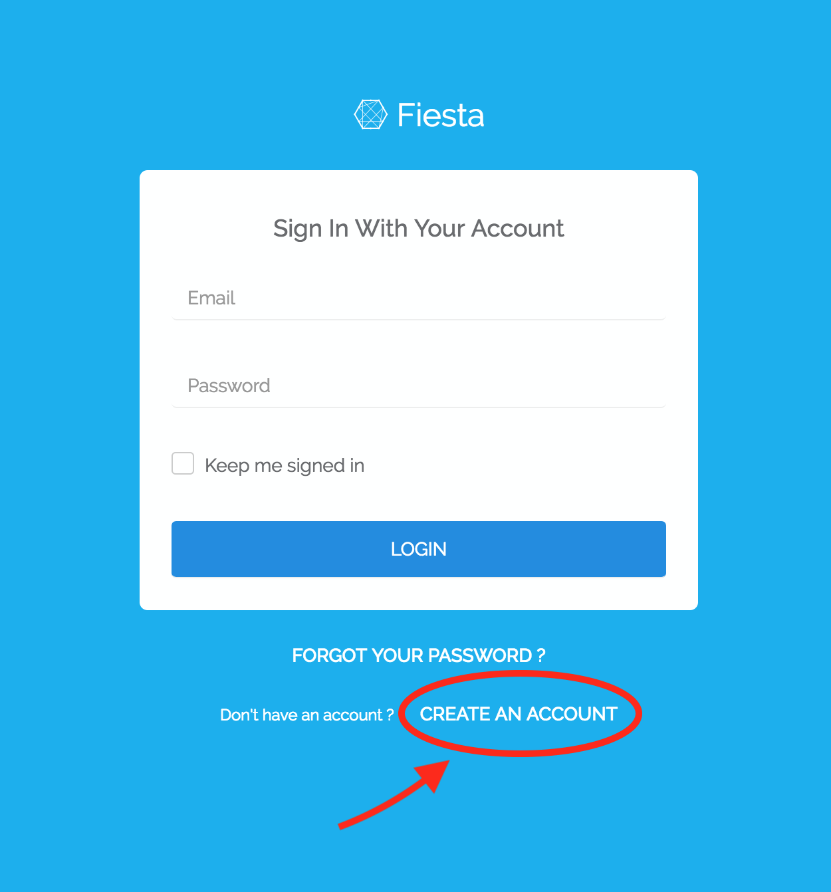
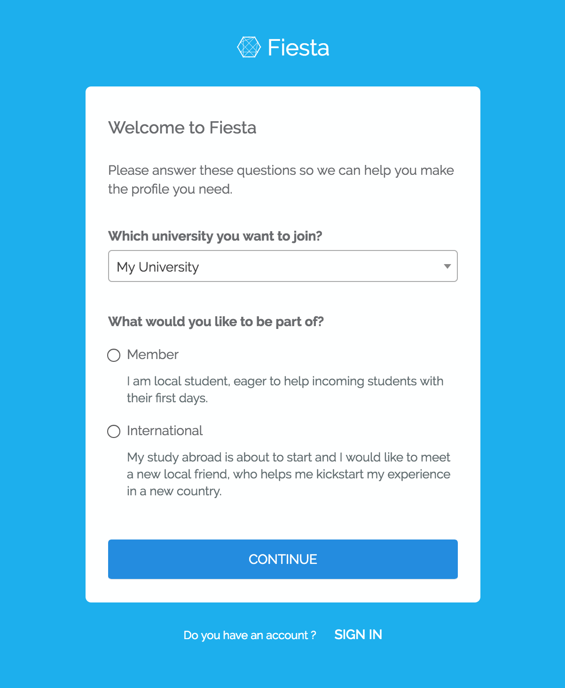
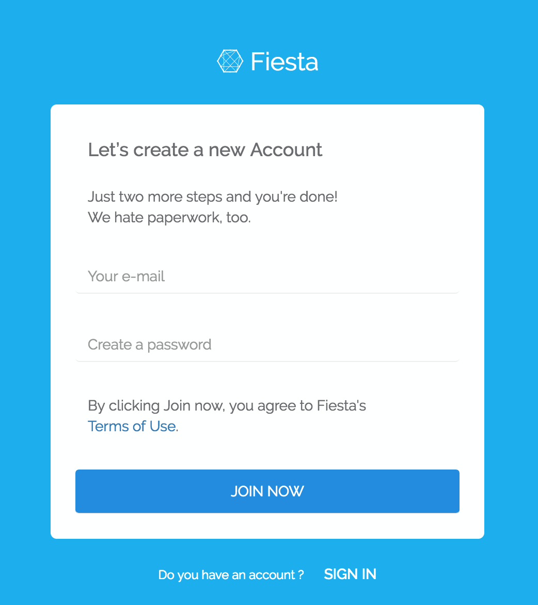
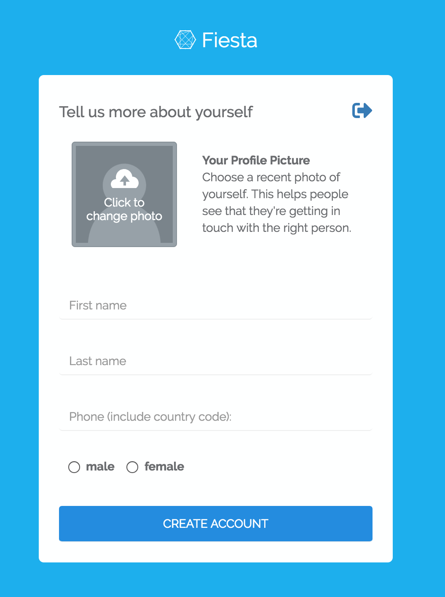
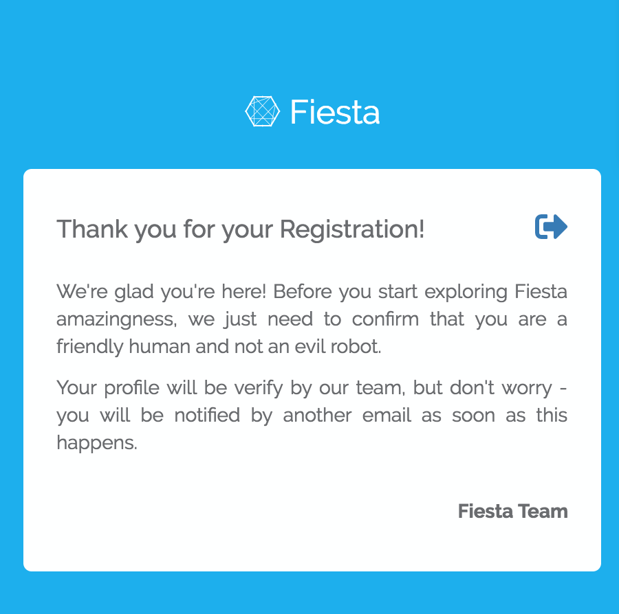

# Getting Started
## Register
If you are an **international exchange student** or a **local student** and you want to participate in the buddy programme you need to register to the Fiesta System. You can find the [registration link](https://fiesta.esncz.org/setup) in the bottom part of the [login screen](https://fiesta.esncz.org).

In the registration you need to first decide if you are international exchange student or local student.

## International Exchange Student
If you are going on your exchange (Erasmus+, etc.) and want to get a buddy assigned that will help you getting around a new city you should specify **Internation** and choose University you're going to study at.

## Local Student
If you are a local student and want to help international exchange students to get around city you should specify **Member** and choose University you're studying at. By registering into the Fiesta System as **Member** (Local Student) you will be able to get your international exchange student assigned and be his/her buddy. You will also be able to participate on our events or help with it's organisation.

## Login Info
In the next step please your login info. Please make sure you have access to the email address since it can be used to recover your password in case you forget it.

## Profile Detail
Fill in your profile details. We encourgae people to fill as much as possible and include their picture.

## Complete the registration

Complete the registration by hitting the **CREATE  ACCOUNT** button. Please note that when registering as a Member (Local Student) we need to approve your registration first. You will receive an notification email as soon as your account gets approved.

